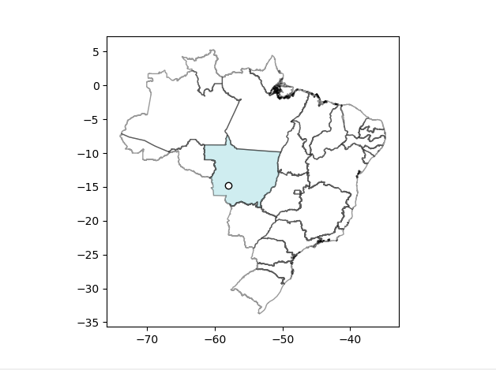

# CGT5
Repository for last assignment of Computer Graphics Class of Professor Márcio Pinho

## Installation

```bash
conda create --name cg python=3.8.3
conda activate cg
conda install --file requirements.txt
```

This project was developed using Windows. It requires Python Tools, included in Visual Studio 2019, 
for compiling the attached library, `geometries`:

```bash
cd geometries
conda activate cg
python setup.py install
```

Test it in command line as:

```bash
conda activate cg
python
```
```python
import geometries
print(geometries.__doc__)
```

## Testing

There are three scripts that can be tested.

### Subplots

Call it with command

```bash
python subplots.py
``` 

It should output an animated plot on a new screen, like the one below:


From left to right, top to bottom:

1. Algorithm for testing inclusion of points in convex polygon (blue = correct prediction, red = incorrect prediction, 
i.e. algorithm says it is outside, but is indeed inside). Implementation is in file `polygon.h`, method `isInsideConvex`
2. Same as `1`
3. Algorithm for testing inclusion of points in concave polygon (blue = correct prediction, red = incorrect prediction, 
i.e. algorithm says it is outside, but is indeed inside). Implementation is in file `polygon.h`, method `isInsideConcave`
4. Same as `3`
5. Convex hull algorithm. Black lines are from concave polygon, blue area is the generated convex polygon. 
Implementation is in file `polygon.h`, method `PyPolygon_toConvexHull`.
6. Same as `6`
7. Envelope algorithm applied to two convex polygons. Green = polygons do not intersect, red otherwise. Envelope is
implemented in method `PyPolygon_addEnvelope` of file `polygon.h`. Collision is implemented in file `polygon.h`, 
method `PyPolygon_checkEnvelopeIntersection`.
8. Same as `7`.
9. A Map of polygons, using the slab algorithm to detect collision. Uses a fixed number of slabs, instead of one slab 
per vertex. Implementation in file `map.h`, in constructor `PyMap_init`. Test is implemented in method 
`PyMap_checkInside`.

### map_plot

For a demonstration of slab algorithm in a map of Brazil, run script `map_plot.py`:
 
 ```bash
python  map_plot.py --map-path resources\Estados_do_Brasil 
``` 

It should output an animated map, the same way as bullet `9` of previous section.




### Test times

Finally, if instead of plotting, one desires to measure the differences in times of execution of different methods, it 
is only required to pass parameter `--test-times` to `map_plot.py` script:

```bash
python  map_plot.py --map-path resources\Estados_do_Brasil --test-times
``` 

It will then output to the terminal the result of 1000 executions of three different methods of testing inclusion of 
points in polygons:

```bash
regular: 0.053000
map: 0.074002
convexHull: 0.002000
```

Where:

* regular: Given a polygon, returns the execution time of running 1000 times the algorithm of inclusion of point in 
concave polygon
* Given a map,  returns the execution time of running 1000 times the algorithm of inclusion of point in 
a map, using slab algorithm
* Given a polygon, converts it to a Convex polygon, then runs 1000 times the algorithm of inclusion of point in convex 
polygon, and displays the execution time

The code for testing times is depicted below:
```python
myMap = Map(polygons=[polygon])

func_dict = {
    'regular': polygon.isInside,
    'map': myMap.checkInside,
    'convexHull': polygon.toConvexHull().isInside
}

time_sum = {k: 0 for k in func_dict.keys()}

n_repeat = 10000
for k, func in func_dict.items():
    t1 = dt.now()
    for repeat in range(n_repeat):
        func(point)
    t2 = dt.now()
    time_sum[k] = (t2 - t1).total_seconds()

print('times for different methods:')
for k, time in time_sum.items():
    print('%s: %f' % (k, time))
```